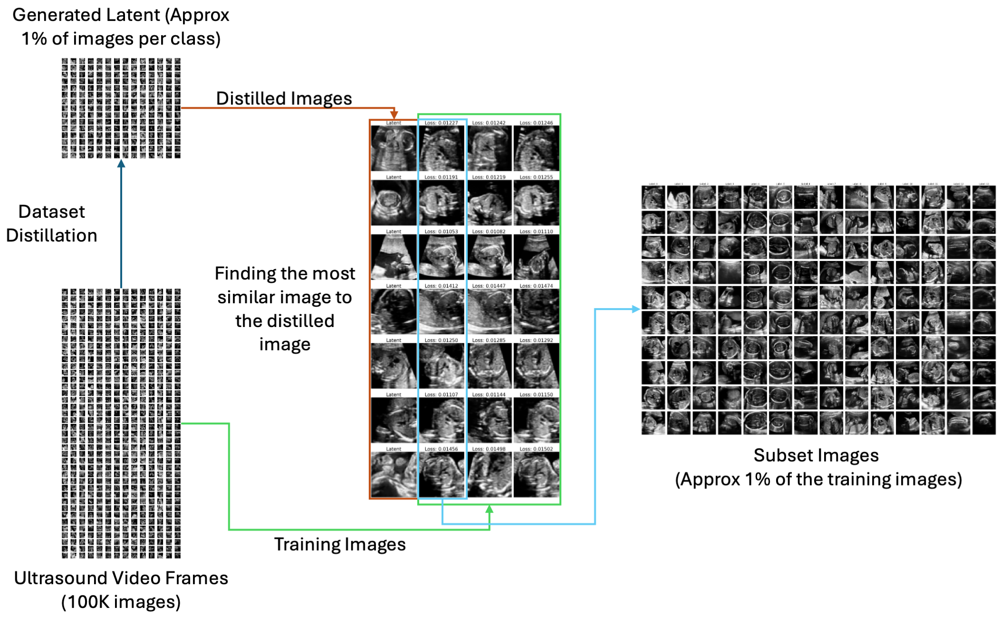

We aim to create the optimal subset of ultrasound video frames via dataset distillation. Our approach involves three steps to find this optimal subset. First, we trained the generator from the GAN to be the transform function that changes the latent vector to the image. Second, we trained the latent vector or the distilled images through dataset distillation algorithms to make it representative of each class. Third, we identified the most similar images based on the distilled images. 

# Docker Setup

This repository contains the necessary files to set up and run a Python application in a Docker container. The Docker image is built using a `python:3.10.12-slim-buster` base image.

## Prerequisites

- **Docker**: Make sure Docker is installed on your system. You can download and install Docker from the official website:
  - [Docker Desktop](https://www.docker.com/products/docker-desktop/)

- **GPU**: Install Follow the official NVIDIA Container Toolkit:
  - [installation instructions](https://docs.nvidia.com/datacenter/cloud-native/container-toolkit/latest/install-guide.html)


## Getting Started

First, download our repo:
```bash
git clone https://github.com/Jack47744/ultrasound_subset.git
cd ultrasound_subset
```

To build the docker image, please run

```bash
docker build -t process_ultrasound_video .
```

## Usage
Below are some example commands to run each method.

Prior to running the distillation command, please make sure that ```host_path_to_video_directory``` and ```host_path_to_output_subset_frame``` exists.

### Assign directory and file variables
```bash
host_path_to_video_directory="/path/to/your_project/videos"
host_path_to_output_subset_frame="/path/to/your_project/output"
video_file_name="video_file.MP4"
```

### Distillation by Distribution matching
The following command will then create the subset selection from the given MP4 file using distribution matching method:
```bash
docker run -it --rm --gpus\
  --name running-app \
  -v "${host_path_to_video_directory}:/usr/src/app/videos" \
  -v "${host_path_to_output_subset_frame}:/usr/src/app/output" \
  process_ultrasound_video --method=dm --video_path "/usr/src/app/videos/${video_file_name}" --output_path "/usr/src/app/output" 
```

### Distillation by Improved Distribution Matching
The following command will then create the subset selection from the given MP4 file using improved distribution matching method:
```bash
docker run -it --rm --gpus\
  --name running-app \
  -v "${host_path_to_video_directory}:/usr/src/app/videos" \
  -v "${host_path_to_output_subset_frame}:/usr/src/app/output" \
  process_ultrasound_video --method=idm --video_path "/usr/src/app/videos/${video_file_name}" --output_path "/usr/src/app/output" 
```

### Distillation by Improved Distribution Matching with Cross Entropy Regularization
The following command will then create the subset selection from the given MP4 file using improved distribution matching with cross entropy regularization method:
```bash
docker run -it --rm --gpus\
  --name running-app \
  -v "${host_path_to_video_directory}:/usr/src/app/videos" \
  -v "${host_path_to_output_subset_frame}:/usr/src/app/output" \
  process_ultrasound_video --method=idm_ce --video_path "/usr/src/app/videos/${video_file_name}" --output_path "/usr/src/app/output" 
```

### Extra Options
Adding ```--use_gan``` will detemine whether to use DCGAN or not which is significantly different. It can be ```True``` or ```False```. The default value is ```True```.

Adding ```--process_every_x_frame``` will perform frame sampling of the video which reduces the computation. The value must be an integer. The default value is ```1```.

Adding ```--min_syn``` will set the minimum of the subset frame per class. For example, if the 1% of the class is less than ```min_syn```, the number of the subset would be ```min_syn```. The default value is  ```10```.

Adding ```--max_syn``` will set the maximum of the subset frame per class. For example, if the 1% of the class is more than ```max_syn```, the number of the subset would be ```max_syn```. The default value is  ```200```.

Adding ```--sample_ratio``` will set the subset ratio from the whole dataset. The default value is  ```0.01```.

Adding ```--is_save_img``` will save the image of the latent. The default value is  ```False```.

Adding ```--is_save_latent``` will save the latent. The default value is  ```False```.

